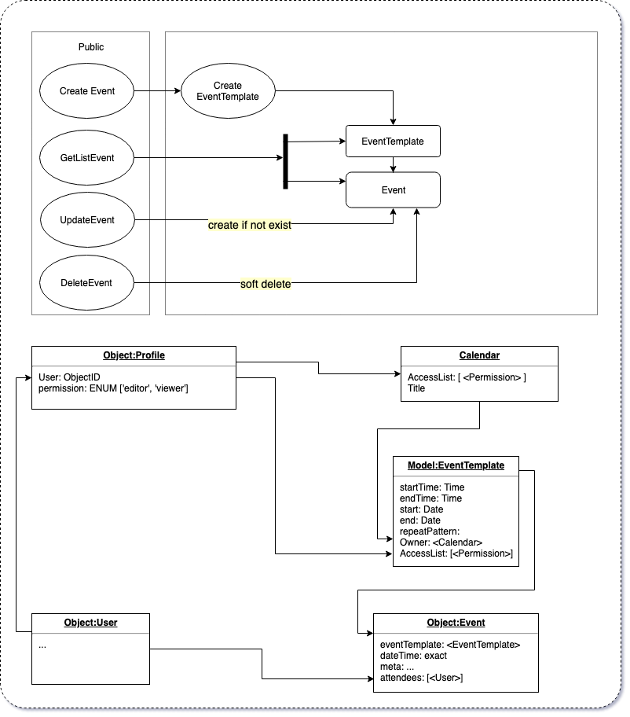

# planner

NPM package to manage events

Methods

## HOW TO

```javascript
createEvent(payload); //<Event>
updateEvent(id, payload); //<Event>
getEvent(id); //<Event>
getEvents({
  range: start - end,
  status: 'active' | 'inactive' | 'deleted',
  // owner: CalendarID,
}); // [<Event>]
deleteEvent(EventID); // ok|<Error>
```

### Issue

sort out how to manage access by owner|creater|accessList field

### Schema



### Usage

```javascript
async () => {
  const success = await EventCore.createEvent({
    title: 'Yoga Class',
    organizerId: user.id,
    startTime: 1070, // 17:50 = 17*60 + 50
    endTime: 1180, // 19:40 = 19*60 + 40
    startDate: moment('2019-02-08 09:30'), // required
    endDate: moment('2020-02-08 11:30'), // required
    duration: 110, // 1:50 = 60 + 50
    status: 'active',
    location: 'To Be Provided',
    repeatable: {
      dayOfWeek: {
        0: true, // Monday
        2: true, // Wednesday
        4: true, // Friday
      },
    },
  });

  const eventList = await EventCore.getList({
    startDate: moment('2019-04-08'), // required
    endDate: moment('2019-04-22'), // required
    // owner: user.id, // optional
    accessID: user.id | profile.id | role.id, // optional
  });
  console.log(eventList.length); // 6

  const event = eventList[0];
  console.log(event);
  // {
  //  title: 'Yoga Class',
  //  organizerId: user.id,
  //  startDateTime: moment('2019-04-10 09:30'), // required
  //  endDateTime: moment('2020-04-10 11:30'), // required
  //  status: 'active',
  //  location: 'To Be Provided',
  // }

  event.meta = {
    some: 'none related to repeatable events',
  };

  event.attendees.add(user1.id);

  // {
  //  title: 'Yoga Class',
  //  organizerId: user.id,
  //  startDateTime: moment('2019-04-10 09:30'), // required
  //  endDateTime: moment('2020-04-10 11:30'), // required
  //  status: 'active',
  //  location: 'To Be Provided',
  //  attendees: [ user1.id ]
  //  meta: {
  //    some: 'none related to repeatable events'
  //  }
  // }

  event.save();
};
```
