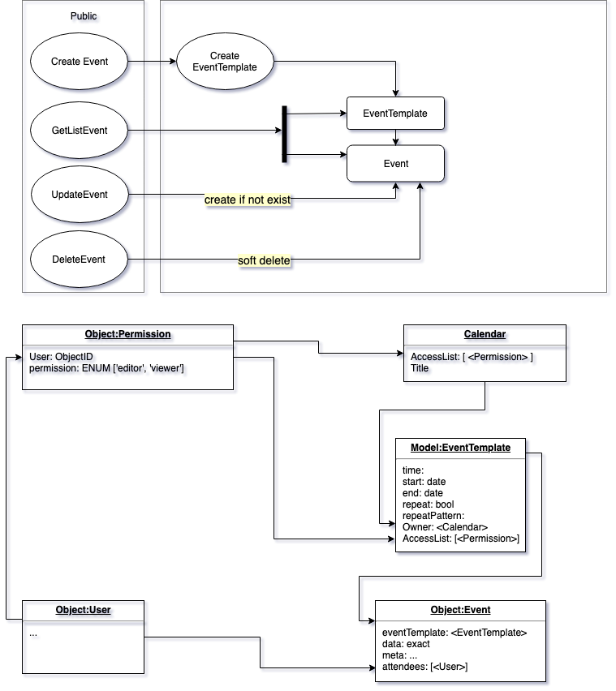

# planner
NPM package to manage events

Methods 

## HOW TO
```javascript
createEvent(payload) //<Event> 
updateEvent (id, payload) //<Event>
getEvent(id) //<Event>
getEvents({
 range:(start-end),
 status:('active'|'inactive'|'deleted'),
 owner:(CalendarID)
}) // [<Event>]
deleteEvent(EventID) // ok|<Error>
```

TODO:
- Create models based on 

- implement actions
